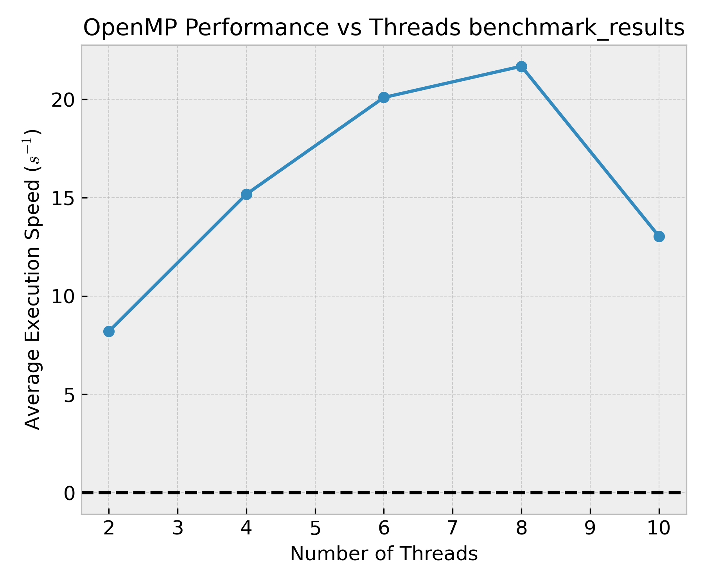

# openmp-benchmark

**`openmp-benchmark`** is a lightweight Python CLI tool that benchmarks OpenMP-enabled Python scripts by varying the number of OpenMP threads. It executes external scripts (that must follow certain restrictions, see below) inside a subprocess with correct `OMP_NUM_THREADS` control, and extracts timing from the output of the external script.

---

## Installation

To install locally:

```bash
pip install .
```

Or for development/editable install:

```bash
pip install -e .
```

---

## Usage

After installation, run:

```bash
openmp-benchmark <your_script.py> [options]
```

### Example

```bash
openmp-benchmark example_script.py --min-threads 2 --max-threads 10 --step-threads 2 --repeat 5
```

### Command-line Options

| Option           | Description                                          | Default                                       |
|------------------|------------------------------------------------------|-----------------------------------------------|
| `--min-threads`  | Minimum number of OpenMP threads to test                                  | `2`                      |
| `--max-threads`  | Maximum number of OpenMP threads to test                                  | `20`                     |
| `--step-threads` | Number of OpenMP threads to step by                                       | `2`                      |
| `--repeat`       | Number of repetitions of the compute, to average down noise               | `3`                      |
| `--output`       | Output CSV/PNG filename                                                   | `benchmark_results`      |
| `--no-plot`      | Disable plot generation                                                   | Off (plot is shown)      |

---

## Benchmark Target Script Format

The script you benchmark must:

1. Perform computation using OpenMP-parallelizable libraries (e.g.certain `numpy` functions)
2. Measure and `print()` the compute time (as a float in seconds) **with no extra output**

### Example: `example_script.py`

With the numpy dot product example in `examples/`

```python
import time
import numpy as np

if __name__ == "__main__":
    # Create two large matrices
    N = 4000
    A = np.random.rand(N, N)
    B = np.random.rand(N, N)

    # Time the dot product
    start = time.perf_counter()
    C = np.dot(A, B)
    end = time.perf_counter()

    # Print only the elapsed time
    print(end - start)
```

we get the following plot



Other specialized examples (e.g. for CMB map analysis) can be found in the `examples/` directory.

---

## Output

- A CSV file (default: `benchmark_results.csv`) with columns:
  - `Threads`: number of threads used
  - `Avg Time (s)`: average time across `--repeat` runs  
- A plot (default: `benchmark_results.png`) of execution time vs thread count (unless `--no-plot` is passed)

---

## Development

To develop or modify the tool:

```bash
git clone <your-repo-url>
cd openmp-benchmark
pip install -e .
```

Then you can run the CLI anywhere using:

```bash
openmp-benchmark path/to/your_script.py
```

---

## License

MIT License
